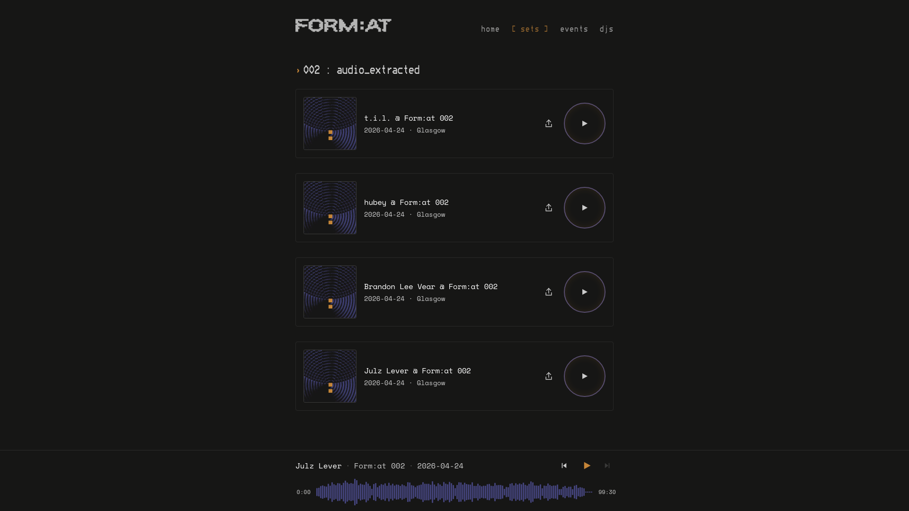
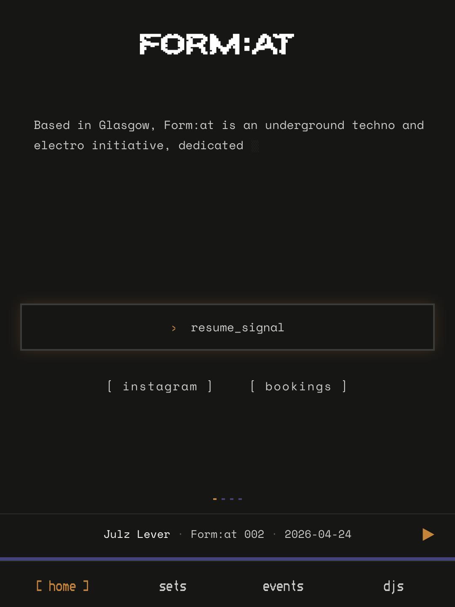

# Form:at

A progressive web app for [Form:at](https://formatglasgow.com), a techno collective in Glasgow. It publishes the collective's recorded sets, its events and its DJs.

The part that drove most of the engineering: it lets you save a set to your phone and listen on the Glasgow Subway, where there is no signal. Sets are 90-minute mixes, typically 100–220MB each — which is what makes "just save it offline" a real problem rather than a checkbox.

Live at **[formatglasgow.com](https://formatglasgow.com)**.





---

## Monorepo structure

```
apps/web           public site + audio player   → formatglasgow.com
apps/admin         internal dashboard           → admin.formatglasgow.com
apps/rum-archiver  daily analytics cron Worker  → form-at-rum-archiver
packages/ui        design system + Storybook
packages/data      shared catalogue, queries, push
packages/tsconfig  shared TS config
```

pnpm workspaces + Turborepo. **Apps never import each other** — only `packages/*` are shared. That's the rule that keeps two independently-deployed apps from quietly fusing into one. It's a convention held by review rather than by a lint rule, and no cross-app import exists today ([`TECH_DEBT.md`](TECH_DEBT.md) item 25 covers enforcing it).

**`apps/admin` is a separate app, not a route inside the public site.** It's a separate Cloudflare Pages project on its own subdomain, which is what makes the security model possible: Cloudflare Access gates `admin.formatglasgow.com` at the edge, so the dashboard needs no login code at all (see below). A `/admin` route inside the public site couldn't be gated that way without putting Access in front of the whole site. It also means an admin deploy can't break the public site — `deploy.yml` has separate `deploy` and `deploy-admin` jobs.

**`packages/ui` was extracted late, deliberately.** The project's first commit is 2026-05-05; the design system was pulled out on 2026-07-30, about twelve weeks later, one day before `apps/admin` was scaffolded. Until a second consumer actually existed, the components lived in `apps/web` where they were used. What moved out is only what's genuinely presentational — `Text`/`Heading`/`Button`/`TextButton`/`Card`/`Modal`/`TerminalRow`/`BracketLabel`/`ToastShell` and the icon set. Anything coupled to Zustand, to TanStack Router, or to this app's asset-URL conventions stayed in `apps/web/app/components/`.

It ships **raw `.tsx`/`.css` with no build step**, consumed straight through the pnpm workspace symlink. One fewer build to configure, and Vite compiles it as if it were app source. The one real cost is that Tailwind's automatic source scanning skips `node_modules`, so `apps/web/app/styles/global.css` needs an explicit `@source` directive pointing at `packages/ui/src` or classes used only inside the package get stripped from the bundle.

**`apps/rum-archiver` is a Worker, not a Pages project**, and that's forced rather than chosen: Cloudflare Pages Functions cannot run cron — they expose only HTTP handlers — so a scheduled job cannot live inside either app. It captures Cloudflare's analytics into D1 daily before they degrade (see [below](#cloudflare-deletes-the-detail-in-its-own-analytics-after-a-week)). It has its own [README](apps/rum-archiver/README.md).

**`packages/data`** holds what both apps genuinely share: the sets catalogue and its types (`sets.ts`), the per-set analytics query (`set-stats.ts`), and Web Push sending (`webPush.ts`). Queries used by only one app deliberately stay in that app — the admin dashboard's aggregate queries live in `apps/admin/app/data/admin-stats.ts` and have never had a second consumer, so they were never promoted.

**What the dashboard shows:** first-party product metrics from D1 — installs, plays, offline saves, push subscribers, per-set breakdowns — plus two live reads of Cloudflare's own analytics through the GraphQL Analytics API (`apps/admin/app/data/cf-analytics.ts`), shown side by side because the gap between them is the point.

`edge_traffic` counts HTTP requests at Cloudflare's edge, bots included. `visits` comes from the Web Analytics beacon and counts real browsers, with bot-flagged rows removed by us — Cloudflare's RUM records bots too, confirmed in our own data. A visit there is a page load arriving from a different site or a direct link, so internal navigation doesn't add one, and it counts neither sessions nor people: Web Analytics stores no identifier, so it can't count distinct humans at all.

Both numbers are correct and they will disagree substantially. The cards say why rather than leaving it to be discovered. A third card, `visits_history`, reads the D1 archive instead of Cloudflare — deliberately separate rather than one series stitched from both, because the two have different provenance and a single number spanning them would hide exactly the kind of seam this dashboard has repeatedly got wrong.

The beacon is injected by the app itself in `apps/web/app/utils/rootHead.ts` rather than relying on Cloudflare's automatic edge injection, which worked and then stopped with no deploy to explain it.

These cards exist at all for a plain reason: two of the three collective members have no Cloudflare account, so a number only visible in Cloudflare's own dashboard doesn't exist for them.

---

## Technology choices

**TanStack Start (v1) over Next.js or plain Vite + React.** The deployment target drove this. The site is SSR'd and runs on the Cloudflare Workers runtime, not Node — so what mattered was a framework that compiles to a Workers-compatible bundle without a Node adapter shim in the way. Start v1 is pure Vite — no Nitro, and no Vinxi layer since it was dropped during v1 (`pnpm-lock.yaml` has the exact version in use).

Three of its features are load-bearing here rather than incidental: file-based routing (`apps/web/app/routes/`), route loaders that run at SSR time so `/sets` arrives with its play counts already rendered, and `createServerFn` for typed server calls with no hand-written API layer. Routes that *are* pure endpoints use `createFileRoute` with a `server: { handlers }` option and no component.

The Workers target isn't free. `apps/web/app/server.ts` is a custom server entry that exists solely to handle Cloudflare's `fetch(request, env, ctx)` calling convention and forward `env.DB` through as `context.cloudflare.env`. **Without that file, D1 is unreachable from every piece of server-side code** — the framework's own entry doesn't know about Cloudflare bindings. `apps/admin/app/server.ts` is the same pattern.

**The whole Cloudflare stack, chosen together.** The coherence is the point — one platform, one deploy story, one `wrangler.toml`:

| | |
|---|---|
| **Pages** | hosts both apps as separate projects |
| **Workers** | the SSR runtime — and, separately, a Cron Trigger Worker for the analytics archive, because Pages can't run cron |
| **D1** (SQLite) | play analytics + the sets catalogue |
| **R2** | audio files — free egress, which matters when a single play is 100–220MB |
| **Access** | edge auth for the admin subdomain, so there's no auth code to write |
| **GraphQL Analytics API** | zone edge traffic + Web Analytics (RUM) visits, read live into the admin dashboard |

R2 is fronted by a custom domain, `cdn.formatglasgow.com`, rather than an R2 public bucket URL — no rate limit and Cloudflare edge caching. Every reference to that host goes through `AUDIO_HOST`/`AUDIO_ORIGIN` in `packages/data/src/sets.ts` so it's one edit if it ever moves.

**Zustand for state, with persistence that's narrower than it looks.** Store is split into slices (`playerSlice`, `offlineSlice`) in `apps/web/app/store/`. Persistence matters concretely here: playback position per track, so a 90-minute set resumes where you left it, and which sets are saved offline. But **`MusicSet` objects are never persisted** — only IDs are written to localStorage and re-hydrated through `getSet()` on load. Persisted objects are a migration hazard the moment the shape changes; persisted IDs aren't.

**Workbox's libraries, but not a PWA plugin.** `vite-plugin-pwa` isn't a dependency; only the `workbox-*` runtime packages are. The service worker is hand-written (`apps/web/app/sw.ts`) and built by a ~90-line custom Vite plugin (`buildServiceWorker` in `apps/web/vite.config.ts`) that walks `dist/client`, assembles the precache manifest and esbuilds the SW, substituting the manifest via `define`.

Workbox earns its place for three specific pieces rather than as a framework: `precacheAndRoute`, `StaleWhileRevalidate` for the navigation/artwork/route-data caches, and `workbox-range-requests`' `createPartialResponse`, which is what makes seeking work on offline audio.

Two decisions inside that plugin were paid for in re-downloads. The precache list is an **explicit allowlist**, not "everything except media" — so a file dropped into `public/` later can't quietly bloat the precache budget.

And a precache entry's revision is an **md5 of file content**, except for Vite's content-hashed assets which need no revision at all. The hash-detection character class has to include `_` and `-`, because Vite uses base64url; without them about a quarter of assets fell through and re-downloaded on every deploy despite identical content. The revision token was `mtime` before that, which meant CI's fresh checkouts gave every font and icon a new mtime and every user re-downloaded them on every deploy.

**Tooling**, briefly, each with a reason:

- **Biome** instead of ESLint + Prettier — one tool, one config, one pass; formatting and linting stop disagreeing.
- **Vitest** for unit tests — shares the Vite transform pipeline, so there's no second build config to keep aligned.
- **Playwright** for e2e across four projects: `chromium`, `webkit`, `mobile-chrome` (Pixel 7), `mobile-safari` (iPhone 14). WebKit isn't optional for this project — iOS is where PWA and audio behaviour diverges most.
- **Turborepo** for task orchestration and caching across workspaces; **pnpm workspaces** for linking, with `packageManager` pinned so CI resolves the same version.
- **knip** in CI to fail on unused exports and dependencies — a monorepo accumulates dead code between packages faster than any one person notices.
- **Storybook + Chromatic** for `packages/ui`. Interaction tests deliberately run through plain Vitest + jsdom using Storybook's portable-stories API (`composeStories`) rather than the Storybook test-runner, which would need a second browser install in CI.

---

## Interesting engineering

Each of these started as a constraint, not a feature idea.

### 220MB of audio has to survive with no signal

*Constraint: the Subway has no reception, and a set is 100–220MB.*

Sets download into IndexedDB with real progress, and the service worker serves them back from there. Three details are load-bearing:

**IndexedDB rather than Cache Storage.** WebKit/iOS is unreliable with large blob entries in Cache Storage. IDB has the same origin-level quota with no documented per-entry cap, and offers the same API in both `Window` and `ServiceWorkerGlobalScope` — which this design requires, since the page writes and the SW reads. Reasoning and the upstream issue are in `apps/web/app/data/offline-audio.ts`.

**A quota pre-flight, and honest failure classification.** `navigator.storage.estimate()` is checked before starting, and failures are classified rather than lumped together (`classifyDownloadFailure` in `offlineSlice.ts`): `QuotaExceededError` and `RangeError` both mean "this device can't hold this set" and map to `quota`; a network failure maps to `network` and is worth retrying. Telling someone to retry when they need to free 200MB is a worse bug than the failure itself.

`estimate()` is approximate and Firefox doesn't expose it at all, so the pre-flight is a fast-path courtesy, not the real guard — the write itself is.

**Range requests, so seeking works offline.** The SW's audio route builds a synthetic `Response` from the stored blob and runs it through `createPartialResponse` when — and only when — a `Range` header is present. `<audio>` seeks with `Range: bytes=N-`; without 206 support, dragging the scrubber on a saved 100MB set re-reads from byte 0.

There's a hard-won rule in that handler: **never rebuild the `Request` before hitting the network.** Doing so breaks playback two separate ways. `new Request(url, {...})` defaults `mode` to `cors`, which makes the browser block R2's response to `<audio>`'s natively no-cors request. And even a rebuild that copies `mode` explicitly *silently drops the `Range` header*, because a `Headers` object under the Fetch spec's request-no-cors guard discards anything not no-CORS-safelisted. Node's undici doesn't implement that guard, so it can't be caught in unit tests — only in a real browser.

### Browser tabs never read the offline library

*Constraint: not technical — a product decision that had to be enforced technically.*

Only the **installed app** plays from IndexedDB. A browser tab always streams from the network, even for a set that's saved. "Saved to this app" is a coherent promise; "saved in this browser tab, on this device, until the browser evicts it" isn't. The page tags playback URLs with `?ctx=app` (`apps/web/app/utils/appContext.ts`) only in standalone display-mode, and that marker is the service worker's single source of truth for who's asking. The marker is stripped only to derive the IDB key, so lookups match the bare URL the download stored.

### A 220MB upload can't go through a Worker

*Constraint: Cloudflare's Workers request-body cap is 100MB. The file is bigger than that.*

So the file never touches the Worker. `apps/admin/app/routes/api/sets-presign.ts` presigns three direct-to-R2 `PUT` URLs (audio, artwork, peaks) and the browser uploads straight to R2.

Worth stating plainly: the first real upload attempt, 2026-08-18, got no further than selecting the file — `apps/admin`'s CSP had no `media-src` directive, so the duration-read step silently blocked a perfectly valid mp3, and no unit test could have caught it (jsdom enforces no CSP; the header only exists on the real `server.ts` response). Fixed — and the very next attempt, same day, hit a second CSP gap one step later: `connect-src` had no allowance for R2's upload host, so the three PUTs above were silently blocked too, surfacing as a generic "check your connection" that had nothing to do with the connection. Also fixed, and the third attempt that same day went all the way through: a real 134MB set (audio + artwork + peaks), presigned, PUT to R2 and written to the catalogue, now live and publicly served. That proves R2's CORS config, the presigned URL surviving a real `PUT`, and XHR progress against real R2 — the one thing still genuinely untested is what a *dropped connection* mid-upload does, since these are single PUTs with no resume and 134MB completing cleanly doesn't exercise that. Tracked as item 23a in [`TECH_DEBT.md`](TECH_DEBT.md), along with the two other paths in the same position.

The upload form stores exactly what it's given — nothing downstream checks loudness or true peak, so a hot recording goes live exactly as hot as it came in (see item 23a again). Run the audio through `apps/web/scripts/master-set.ts` (`apps/web/scripts/README.md`'s "Mastering a new set" section) before it ever reaches this form.

Progress reporting forced a second decision: `fetch()` still has no upload-progress API — no `onUploadProgress`, and the streaming-request-body workaround has inconsistent browser support. `XMLHttpRequest.upload.onprogress` is the mechanism that actually works, which is why `apps/admin/app/utils/uploadWithProgress.ts` uses XHR in an otherwise modern codebase. A deliberate limitation: a dropped connection restarts that file's PUT from zero, since these are single PUTs rather than multipart uploads.

### Waveform peaks are computed with ffmpeg, not in the browser

*Constraint: decoding a 90-minute MP3 in the browser needs about 2GB of RAM.*

`decodeAudioData` holds the entire decoded file in memory as float32 PCM. For a 90-minute stereo set at 44.1kHz that's 90 × 60 × 44,100 × 2 × 4 bytes ≈ **1.9GB** — before anything is drawn. On a phone it doesn't merely run slowly, it fails.

So peaks are precomputed offline: `scripts/generate-peaks.mjs` pipes the MP3 through ffmpeg, downmixing to mono at 8kHz as raw `f32le`, and reduces it to 1000 amplitude values in a JSON file that uploads to R2 alongside the audio. The waveform then renders from a file measured in kilobytes.

Those values aren't bounded to `[0, 1]` — real masters go well above it (1.882 observed on one live set, against an earlier-assumed max of 1.137), and `Waveform.tsx`'s bar-height calculation clamps to 1 before scaling for exactly that reason. An unclamped peak past ~1.11 would make the bar taller than its own canvas and get silently edge-clipped, rendering every loud section as the same flat block instead of its real shape — found against that same live set, 2026-08-18.

Separately, every waveform is also scaled to *its own* loudest peak before that clamp, not a shared reference — peaks are raw amplitude, so a set correctly mastered quieter to match the rest of the catalogue never gets its bars near the top of the container otherwise, even though its own loudest moment is exactly as much a peak for that track as a hotter master's is. Confirmed against real data: an unnormalized quieter set reached only 51% of the container height at its single loudest bar, against 90% for a hotter one — the catalogue's loudness-matching (see the upload section above) was making every re-mastered set's waveform look flat by comparison until this was added, 2026-08-19.

### The standard Web Push library doesn't run on Workers

*Constraint: `web-push`, the obvious choice, depends on Node's `crypto` and `https`.*

It doesn't work in the Workers runtime at all ([web-push-libs/web-push#718](https://github.com/web-push-libs/web-push/issues/718)). `packages/data/src/webPush.ts` uses `@pushforge/builder` instead — selected by reading its compiled output to confirm it's built on `globalThis.crypto.subtle` and `fetch` and nothing Node-specific. That's what lets one module serve both callers: a local Node script (`apps/web/scripts/send-push.ts`) and the admin endpoint (`apps/admin/app/routes/api/send-push.ts`) running on Workers.

### The catalogue is in a database, but the app is offline-first

*Constraint: the source of truth moved to D1, and a cold offline start can't query D1.*

The `sets` table in D1 is authoritative — the admin dashboard writes to it, and new sets appear on the public site with no deploy. But an offline first-visit has no database, so a **build-time snapshot is committed to git**: `packages/data/src/sets.generated.ts`, regenerated by `apps/web/scripts/generate-sets-snapshot.ts` immediately before the production build in `deploy.yml`.

Both halves of that matter. Because the snapshot is committed rather than generated, `pnpm dev`, `tsc` and every CI job read what's in the repo and **need no Cloudflare credentials at all**. And because the snapshot is regenerated at deploy time, the shipped bundle always reflects the live table. The generator fails loudly on any query error rather than emitting an empty array — silently shipping an empty catalogue as the offline fallback is the worst available outcome.

At runtime it's an overlay rather than a simple fallback: the listing merges live D1 rows over the snapshot with **live winning** (`mergeSets` in `packages/data/src/sets.ts`), and degrades to snapshot-only when D1 is unreachable. The single-set lookup uses the same precedence, falling back only on a genuine miss.

Checking the snapshot first would be the bug: a direct `UPDATE sets SET … WHERE id = ?` against production is a viable stopgap for fixing a typo, and snapshot-first would leave the detail page serving the old value while the listing already showed the correction. The fallback path is kept in plain functions (`apps/web/app/data/sets.ts`) so tests can drive it with a fake D1.

### Cloudflare deletes the detail in its own analytics after a week

*Constraint: Web Analytics data is exact for 7 days, then aggregated to ~10%.*

That's a property of the data's **age**, not of how wide a query is — a distinction that cost a round of wrong reasoning here, because a 60-day query and a 7-day query returning different sample intervals looks like the query width deciding it. Measured on this site: a 60-day window returned 120 visits extrapolated from **12 real observations**, with only 11 of 55 days carrying any rows at all. Sampling doesn't just blur the numbers, it deletes whole days.

So `apps/rum-archiver` copies each day into D1 while it's still exact. Two guards do the real work.

**A failed read writes nothing** — a partial write is indistinguishable from a quiet day afterwards. And because every run re-fetches the trailing 7 days, a day gets written repeatedly, so the upsert carries `WHERE excluded.sample_interval <= rum_daily.sample_interval`: a late run holding a *degraded* copy of a day an earlier run captured exactly is rejected, while degraded→exact upgrades still apply. Without it the archive would slowly overwrite its own good data with Cloudflare's aggregated version.

Reading it back has its own trap. A day with no row means one of two completely different things — captured and genuinely empty, or never captured at all — and drawing both as `0` renders an outage as a week of confident flat traffic. Coverage is reconstructed as the union of each run's trailing window, and only days inside it can be zero; the rest are `null`. `TrendChart` takes `(number | null)[]` specifically so a gap can render as a gap, because mapping unknown to `0` to fit the component would have been the bug itself.

### Admin auth: no auth code, then auth code anyway

*Constraint: an internal dashboard needs protecting, and hand-rolled auth is where bugs live.*

Cloudflare Access gates `admin.formatglasgow.com` at the edge. The app itself contains zero login, session or password code — it's the same Access login the team already uses.

The part that's easy to get wrong: **edge gating protects page loads, not individual endpoint calls.** So every mutating endpoint verifies the Access identity server-side anyway, through `apps/admin/app/utils/verifyAccessJwt.ts` — `jose` with `createRemoteJWKSet` against the team domain's `/cdn-cgi/access/certs`, checking `iss`, `aud` and `exp`, reading the `Cf-Access-Jwt-Assertion` header and falling back to the `CF_Authorization` cookie (Cloudflare's docs prefer the header; the cookie isn't guaranteed to be forwarded).

All four mutating endpoints do this: set upload, presign, restore, send-push. There is deliberately no dev-mode bypass.

---

## Running it locally

```bash
pnpm install
pnpm dev          # web on :5173, admin on :5174
```

**No Cloudflare credentials are needed for normal development** — the committed catalogue snapshot means `pnpm dev`, `pnpm tsc`, `pnpm test` and every CI job work from a clean clone.

| Command | |
|---|---|
| `pnpm dev` / `pnpm dev:web` / `pnpm dev:admin` | dev servers, all or one |
| `pnpm build` / `pnpm build:web` / `pnpm build:admin` | production build |
| `pnpm start` / `pnpm start:web` / `pnpm start:admin` | serve the production build — web `:4173`, admin `:4174` |
| `pnpm test` | unit tests, all workspaces (~745 across web, admin, ui, data, rum-archiver) |
| `pnpm test:e2e` | Playwright (~100 runs: 68 web across 4 projects, 34 admin across 2); first run needs `pnpm exec playwright install` |
| `pnpm check` | Biome lint + format, then `turbo tsc` |
| `pnpm knip` | unused code and dependency scan |
| `pnpm storybook` | `packages/ui` Storybook on `:6006` |

Everything except `check`, `format` and `knip` is a thin Turbo wrapper; the `:web`/`:admin` variants just add a `--filter`. For a single workspace's own scripts, use `pnpm -C apps/web <script>`.

**Service-worker behaviour can only be tested against a production build.** The dev server never registers a service worker, because Vite's dev transform doesn't emit `sw.js`. For anything PWA-related — install prompt, offline fallback, offline audio, Range seeking:

```bash
pnpm build:web && pnpm start:web    # :4173, real service worker
```

**What does need credentials:** `CLOUDFLARE_API_TOKEN` and `CLOUDFLARE_ACCOUNT_ID` for `pnpm build` at the repo root (it regenerates the catalogue snapshot from live D1) and for any `wrangler` deploy. Push-sending scripts need a VAPID key pair — copy `apps/web/.env.example` to `.env`. Peaks generation needs `ffmpeg` on `PATH`.

The dashboard's `edge_traffic` card needs a `CF_ANALYTICS_TOKEN` Pages secret on `form-at-admin` — not locally, where it falls back to sample data. The archiver Worker needs its own `CF_ANALYTICS_TOKEN` (a *separate*, narrower token — see its [README](apps/rum-archiver/README.md)) plus `ARCHIVE_TRIGGER_SECRET` for the manual-run route.

### CI/CD

- **`ci.yml`** on every push and PR: `static` (Biome + `tsc`), `knip`, `unit`, `chromatic`, `e2e` (Chromium + WebKit).
- **`deploy.yml`** on push to `main`: re-runs `static`/`unit`/`e2e`, then `deploy`, `deploy-admin` and `deploy-rum-archiver` only if all pass, so a direct push to `main` can't skip the suite. Also manually triggerable via `workflow_dispatch`.

One CI detail worth knowing before editing it: the two workflows install *different* Playwright browser sets and their caches are keyed on browser set + lockfile hash. They must never share a cache key — first-writer-wins poisoning cost a debugging session already.

---

## Documentation

The docs in this repo are working engineering artifacts, not decoration. Two are unusual enough to point at directly:

**[`PWA_PROGRESS.md`](PWA_PROGRESS.md)** — a decision log spanning the PWA and offline work. It records what was tried and *rejected*, not just what shipped: the SW audio handler that couldn't rebuild a `Request` (two separate incidents before the rule was understood), why `web-push` was abandoned, an Android bug that reproduced only during playback, and per-decision on-device verification steps. If you want to see how any decision above was actually reached, it's here.

**[`TECH_DEBT.md`](TECH_DEBT.md)** — a tracker where items carry status including **❌ Invalid**, used when the premise turned out to be wrong on investigation rather than when the work got done. Recording a killed item and why beats silently deleting it; the same wrong idea comes back otherwise.

| | |
|---|---|
| [`IMPROVEMENTS.md`](IMPROVEMENTS.md) | product backlog — a checklist of what's shipped vs. still open, with each claim re-verified against the code rather than trusted |
| [`CLAUDE.md`](CLAUDE.md) | conventions and architecture rules — coding standards, the comment register, git workflow |
| [`apps/web/README.md`](apps/web/README.md) | the public site — layout, the production-build-only service worker, and what breaks quietly |
| [`apps/admin/README.md`](apps/admin/README.md) | the dashboard — layout, the two security controls that look redundant, the `null`-not-`0` rule |
| [`apps/web/scripts/README.md`](apps/web/scripts/README.md) | every build/ops script, its flags and setup — push sending, image optimisation, OG banners, sitemap, D1 stats |
| [`apps/web/tests/README.md`](apps/web/tests/README.md) | test conventions and how to add one |
| [`apps/web/images-source/README.md`](apps/web/images-source/README.md) | the image pipeline — what to drop where, and what gets committed |
| [`apps/rum-archiver/README.md`](apps/rum-archiver/README.md) | the analytics cron Worker — why it's standalone, its token scope, secrets and manual trigger |

---

## Licence

Code is MIT. **The images and artist bios are not** — the photographs in
`apps/web/public/images/` belong to the artists and photographers who made them
and were provided for use on formatglasgow.com, not for redistribution. See
[`LICENSE`](LICENSE) for the exact split. If you're pictured here and want your
image taken down, open an issue.

---

## Scope

A real but small project: one collective, a handful of sets, traffic to match. Nothing here is load-tested at scale and it isn't claimed to be. What's interesting isn't the size — it's that a 220MB file on a phone with no signal turns out to constrain almost every layer, from the storage API up to what a browser tab is allowed to promise.

Known deferrals are tracked in `TECH_DEBT.md` rather than hidden: the artwork cache is deliberately unbounded, and uploads aren't resumable — a dropped connection restarts the PUT.
